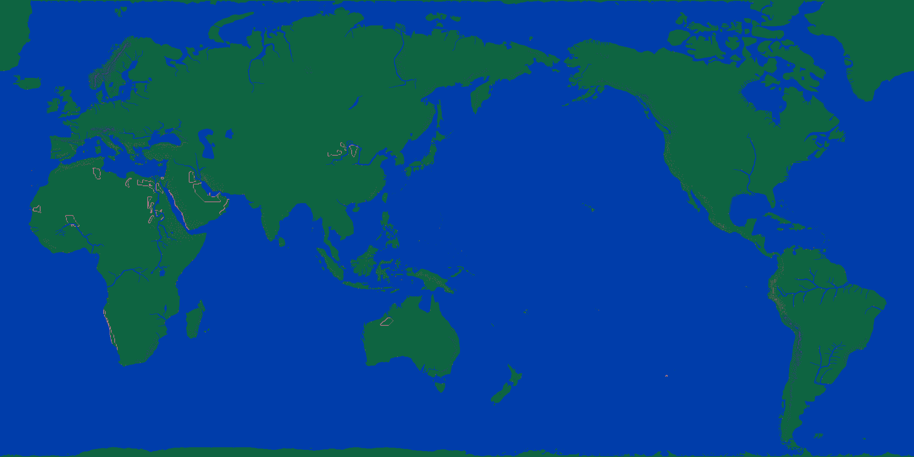

# 대항해시대2 해상이동 — 자산 한눈에

대상: 한글판 `대항해시대2` DOS 원본(`unchartedwaters2/game/water2.zip`)과
**Win95 이식판**(`바탕화면/DH2W95Kor_Win_Test2`, `KOUKAI2.EXE` 444,416 B, 32비트 PE).
목표: 항해 화면을 Direct3D 11 로 다시 그리기 — 3편 `CdsHelper.Game` 의 얼개를 옮긴다.

한 줄 답: **압축부터 화면에 색이 칠해지기까지 한 줄로 다 뚫었다.**
남은 것은 통행 판정과 항해 속도식 둘이다.


게임의 열여섯 색으로 그린 세계지도다 — 남색 바다, 초록 뭍, 파란 강, 살구빛 사막,
잿빛 산. 갈래를 눈으로 보려면 `세계지도.png` 쪽이 낫다.

## 뚫은 길 — Win95 이식판이 열쇠였다

DOS `MAIN.EXE` 는 16비트 볼랜드 라지 모델이라 손이 많이 간다. 그런데 같은 게임의
**Win95 이식판 `KOUKAI2.EXE` 는 평범한 32비트 PE**(ImageBase `0x400000`)라 3편 `CDS_95.EXE`
를 뜯던 방식이 그대로 통한다. 압축 해제 루틴도 지도 푸는 손도 통째로 있었다.

**기준 판은 Win95 이식판으로 잡았다.** 자료는 두 판이 거의 같다 — `CHIP_NO.DAT`·`WINDCUR.DAT`·`MONSTER.DAT`·그림표가 바이트까지
같고, 세계지도는 583,200칸 가운데 **31칸**만 다르다.
갈리는 것은 **칩을 담는 꼴**뿐이다 — 원판은 면 넷 겹판, 이식판은 4비트 꽉 채움인데
**그림은 똑같다**([7.분석-칸에서 칩으로](7.%EB%B6%84%EC%84%9D-%EC%B9%B8%EC%97%90%EC%84%9C%20%EC%B9%A9%EC%9C%BC%EB%A1%9C.md)).

## 한 줄로 이어지는 길

```
WORLDMAP.LZW ─(LS11)→ 청크 3장 ─(조각 + 본보기)→ 칸 1080 x 540
   └─ 칸 값 ─(2x2 자국 또는 DATA1[18] 그림표)→ 칩 2160 x 1080
        └─ 칩 번호 ─(DATA1[11] 겹판 16x16)→ 색인 0~15
             └─ 팔레트(MAIN.EXE 0x3EBCE) ─→ 색
```

| 걸음 | 어디 | 볼 곳 |
|---|---|---|
| 압축 | LS10/LS11 | [2.분석-LS10·LS11 압축 포맷](2.%EB%B6%84%EC%84%9D-LS10%C2%B7LS11%20%EC%95%95%EC%B6%95%20%ED%8F%AC%EB%A7%B7.md) |
| 지도 | 조각 12x12 · 본보기 여섯 | [3.분석-세계지도(WORLDMAP.LZW)](3.%EB%B6%84%EC%84%9D-%EC%84%B8%EA%B3%84%EC%A7%80%EB%8F%84%28WORLDMAP.LZW%29.md) |
| 칩 | 2x2 펴기 · 그림표 | [7.분석-칸에서 칩으로](7.%EB%B6%84%EC%84%9D-%EC%B9%B8%EC%97%90%EC%84%9C%20%EC%B9%A9%EC%9C%BC%EB%A1%9C.md) |
| 바람 | 450바이트 표 셋 · 30x15 | [5.분석-바람·해류(WINDCUR.DAT)](5.%EB%B6%84%EC%84%9D-%EB%B0%94%EB%9E%8C%C2%B7%ED%95%B4%EB%A5%98%28WINDCUR.DAT%29.md) |
| 색 | 열여섯 색 벌 | [9.분석-팔레트(열여섯 색)](9.%EB%B6%84%EC%84%9D-%ED%8C%94%EB%A0%88%ED%8A%B8%28%EC%97%B4%EC%97%AC%EC%84%AF%20%EC%83%89%29.md) |
| 항구 | 지도 101장 · 칩 일곱 벌 | [4.분석-항구지도와 칩](4.%EB%B6%84%EC%84%9D-%ED%95%AD%EA%B5%AC%EC%A7%80%EB%8F%84%EC%99%80%20%EC%B9%A9.md) |
| 항구표 | 이름·자리 130줄 (리스본 0번) | [10.분석-항구 표(이름과 자리)](10.%EB%B6%84%EC%84%9D-%ED%95%AD%EA%B5%AC%20%ED%91%9C%28%EC%9D%B4%EB%A6%84%EA%B3%BC%20%EC%9E%90%EB%A6%AC%29.md) |
| EXE | 주소표 | [6.분석-KOUKAI2.EXE 뜯는 자리](6.%EB%B6%84%EC%84%9D-KOUKAI2.EXE%20%EB%9C%AF%EB%8A%94%20%EC%9E%90%EB%A6%AC.md) |
| 구현 | Direct3D 프로젝트 | [8.구현-Uw2 프로젝트](8.%EA%B5%AC%ED%98%84-Uw2%20%ED%94%84%EB%A1%9C%EC%A0%9D%ED%8A%B8.md) |

## 자리

| 파일 | 크기 | 것 | 상태 |
|---|---:|---|---|
| `WORLDMAP.LZW` | 48,248 | 세계지도 1080x540 | **다 풀었다** |
| `DATA1.LZW` 11번 | 32,768 / 49,152 | 세계 칩 **128장** 16x16 (앞 16KB, 판마다 담는 꼴 다름) | **다 풀었다** |
| `DATA1.LZW` 18번 | 1,024 | 그림표 256 x 4 | **다 풀었다** |
| `WINDCUR.DAT` | 1,350 | 450바이트 표 셋, 30x15 | **다 풀었다** |
| `MONSTER.DAT` | 200 | 괴물 자리 30곳(칩 눈금) | **다 풀었다** |
| `PORTMAP.LZW` | 138,223 | 항구지도 101장 96x96 | **다 풀었다** |
| `PORTCHIP.LZW` | 124,719 | 항구 칩 일곱 벌 x 240장 | **다 풀었다** |
| `CHIP_NO.DAT` | 100 | 항구 → 칩 벌(0~6) | **다 풀었다** |
| `KAO.LZW` | 465,890 | 얼굴 128명 x 2쪽 | 껍데기만 |
| `CHAR.LZW` | 16,238 | 사람 그림 | 껍데기만 |
| `KOUKAI2.DAT` | 333,551 | 세이브 파일 | 정체만 |
| `TRANSIT.DAT` | 19,200 | 이동 연출로 본다 | 안 읽었다 |

읽개는 이 폴더의 `uw2.py` 다.

```python
import uw2
grid  = uw2.read_worldmap('WORLDMAP.LZW')                 # [540][1080] 칸
d1    = uw2.read_archive('DATA1.LZW')
chips = uw2.chip_map(grid, uw2.quad_table(d1[18]))        # [1080][2160] 칩
art   = uw2.tiles_4bpp(d1[11])                            # 칩 그림
```

C# 쪽은 [8.구현-Uw2 프로젝트](8.%EA%B5%AC%ED%98%84-Uw2%20%ED%94%84%EB%A1%9C%EC%A0%9D%ED%8A%B8.md) 의 `Uw2.Support` 다 — 파이썬 결과와 바이트까지 같은 것을 댔다.

## 남은 것 둘

1. **통행 판정.** **칩 0 이 배가 다니는 바다**인 것은 굳혔다 — `MONSTER.DAT` 의 자리
   서른 곳이 하나도 빠짐없이 칩 0 위에 있고 둘레 3x3 이백일흔 칸 가운데 뭍이 한 칸뿐이다.
   다만 **해안 칩(52~63 따위)을 지날 수 있는지**가 안 갈렸고, EXE 안의 판정 자리도 못 찾았다.
2. **항해 속도식.** 3편 `0x0048BCF0`(``30.분석-항해 속도(돛·바람·해류)``) 에 해당하는 자리.

곁들여: 세이브(`KOUKAI2.DAT`)의 함대 자리도 아직이다. 두 벌 떠서 견주면 빠르다 —
좌표가 **칩 눈금**(0~2159 / 0~1079)이라는 것은 이미 안다.

## 3편과 견주기

| | 대항해시대3 | 대항해시대2 |
|---|---|---|
| 지도 | `WORLD.CDS` 2500x1250 · 16비트/칸 | 1080x540 칸 → **2160x1080 칩** · 8비트 |
| 칩 | 16,384장 16x16 · 8비트 그림 | **256장 16x16 · 면 넷 겹판** |
| 팔레트 | 256색 | **16색** |
| 지형표 | EXE `0x004CD048` 0x4000칸 | 아직 못 찾음 |
| 바람·해류 | EXE 표 셋 50x25 · 16비트 | `WINDCUR.DAT` 표 셋 30x15 · 8비트 |
| 함대 좌표 | 경도 0~40000 · 위도 0~20000 | 칩 0~2159 · 0~1079 |
| 항구 화면 | — | `PORTMAP` 101장 96x96 |
