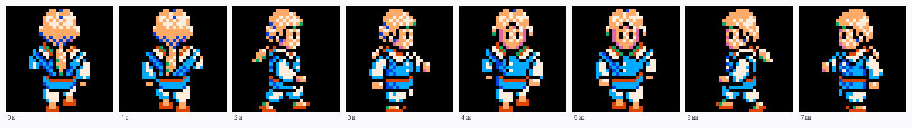

# 대항해시대2 — 사람 그림(CHAR.LZW)

도시 안을 걸어 다니는 사람 그림이다. 항해 화면([[1.분석-해상이동 자산 한눈에]])과
같은 LS 묶음([[2.분석-LS10·LS11 압축 포맷]])에 들어 있고, 색은 열여섯 색
팔레트([[9.분석-팔레트(열여섯 색)]])를 그대로 쓴다.

한 줄 답: **청크 하나가 사람 하나, 32x32 그림 여덟 장이다.**


첫 청크를 구운 것이다 — 주앙 프랑코로 보인다. 왼쪽부터 위·왼쪽·아래·오른쪽이고
쪽마다 걸음이 둘이다.

## 묶음

`CHAR.LZW` 를 풀면 청크가 일곱 나온다.

| 청크 | 크기 | 뜻 |
|---|---|---|
| 0~5 | 8,192 B | 사람 하나씩 |
| 6 | 24,576 B | 8,192 셋 — 사람 셋 |

8,192 = 사람 하나. 그러니 이 파일에 사람이 아홉 든다.

## 청크 속 얼개

8,192 바이트는 **16x16 4비트 조각 예순넷**(조각 하나가 128 B)이다.
조각이 그냥 늘어선 게 아니라 **그림 하나에 가림장 하나가 붙어** 번갈아 놓인다.

```
조각 0  그림 왼위      조각 1  가림 왼위
조각 2  그림 오위      조각 3  가림 오위
조각 4  그림 왼아래    조각 5  가림 왼아래
조각 6  그림 오아래    조각 7  가림 오아래
                              ↑ 여기까지가 32x32 한 장
```

조각 넷을 왼위·오위·왼아래·오아래로 붙여야 사람이 온전해진다.
**조각 하나만 떼어 보면 사람이 왼쪽이나 오른쪽으로 잘려 있다** — 여기서 한참 헤맸다.

가림장은 두 값짜리다. `15` 가 밖, `0` 이 안이다. 그런데 **가림장이 밖이라 이른
자리는 그림도 어김없이 `0`** 이었다(첫 장에서 154 점, 어긋난 것 없음).
그래서 굽지 않고 버린다 — 비침은 색인 `0` 하나로 족하다.

## 조각 폭을 어떻게 골랐나

자료를 세로로 견주었다. 줄 너비를 2~256 바이트로 바꿔 가며
`d[i] != d[i+너비]` 인 자리를 세면 **여덟 바이트(=16 점)에서 가장 적다**(0.232).
그다음이 열여섯 바이트(0.303)인데, 이것은 조각 둘이 가로로 붙어 32 점이 되는
탓에 따라 나온 값이다.

## 여덟 장이 어느 쪽인가

| 장 | 쪽 |
|---|---|
| 0, 1 | 위(뒤통수) |
| 2, 3 | 왼쪽 |
| 4, 5 | 아래(앞모습) |
| 6, 7 | 오른쪽 |

쪽마다 두 장이 걸음 두 개다.

**가로 짝은 자료로 굳혔다.** 점이 있고 없고만 견주면 2 와 6, 3 과 7 이
**하나도 안 틀리고 서로 뒤집힌 꼴**(1.00)이다. 나머지 짝은 0.5~0.9 라 이만큼
딱 떨어지지 않는다.

**위·아래는 화면에 띄워 놓고 갈랐다.** 0 과 4 는 실루엣이 0.91 로 거의 같아
자료만으로는 안 갈린다. 그려 놓고 보니 **4 에 눈이 있고 0 은 뒤통수**였다.
처음에 0 을 앞으로 잡았다가 뒤집었다.

## 헤맨 자리

- **16x32 로 잘랐다.** 그림 한 장에 가림장 한 장이 아래로 딸려 붙어,
  사람 밑에 보라색 덩어리가 그대로 그려졌다.
- **16x16 짝수 조각만 썼다.** 덩어리는 없어졌지만 사람이 반으로 잘렸다.
  조각 넷을 붙여야 한다는 것을 이때 알았다.
- **비침을 15 로 잡았다.** 사람이 시커먼 덩어리가 됐다. 바탕은 `0` 이다.

## 쓰는 곳

`Uw2.Support/Local/Formats/AssetPack.cs`
- `WalkerSheet` 가 청크를 32x32 여덟 장짜리 `asset/char.png`(256x32)로 굽는다
- `CharPose(facing, secondStep)` 가 보는 쪽에서 장 번호를 낸다
- `CharClear = 0`

`Uw2.Game/Engine/Town/Walker.cs` 가 걸음을 밟고,
`SeaMapRenderer.SpriteFrame` 이 판에서 그 장만 잘라 그린다.
얼개는 [[8.구현-Uw2 프로젝트]] 에 적었다.

## 아직 안 굳힌 것

- 청크 아홉이 **누구누구인지** — 주인공 여섯과 견주지 않았다.
- 청크 6(24,576 B)이 셋으로 갈리는 것은 크기로만 짐작한 것이다.
- 밟을 수 있는 칸을 가르는 **게임 표**를 아직 못 찾았다. 지금은 바닥·길 칩이
  쓰는 색을 모아 92% 넘게 그 색으로 그린 칩이면 밟을 수 있다고 본다
  ([[4.분석-항구지도와 칩]]).
