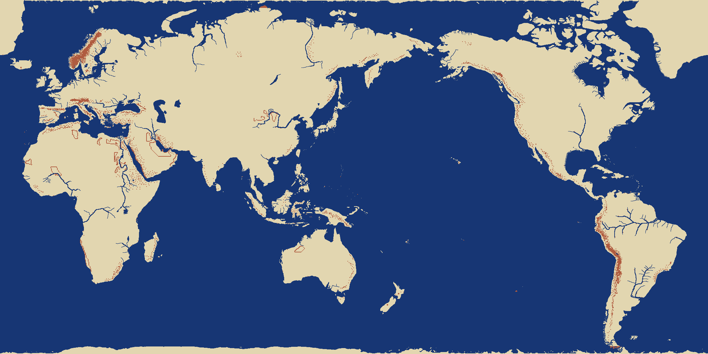

# 세계지도 — 1080 x 540 칸, 그리는 자리에서 2160 x 1080 칩

대상: `WORLDMAP.LZW`. 껍데기는 [2.분석-LS10·LS11 압축 포맷](2.%EB%B6%84%EC%84%9D-LS10%C2%B7LS11%20%EC%95%95%EC%B6%95%20%ED%8F%AC%EB%A7%B7.md), 그리는 얼개는 [7.분석-칸에서 칩으로](7.%EB%B6%84%EC%84%9D-%EC%B9%B8%EC%97%90%EC%84%9C%20%EC%B9%A9%EC%9C%BC%EB%A1%9C.md).

한 줄 답: **12 x 12 칸짜리 조각 4,050장을 90 x 45 로 깐 1080 x 540 칸 지도이고,
칸 하나가 그리는 자리에서 칩 넷이 되어 온 지도가 2160 x 1080 칩이 된다.**
칸 하나가 경도·위도 **3분의 1도**다(1080/360, 540/180).



## 두 겹이다

압축을 풀면 71,274바이트가 나오는데 그게 곧 지도가 아니다.

```
청크 c (c = 0,1,2)
  0x0000  낱말 1350개   조각 i 의 자료가 시작하는 자리(리틀엔디안, 자료부 첫머리부터)
  0x0A8C  자료부        조각 1350개
```

청크 셋은 **세로 띠**다. 청크 c 가 조각 열 `c*30 ~ c*30+29`, 곧 칸 열 `c*360 ~ c*360+359` 를
맡는다. 게임도 한 번에 청크 하나만 메모리에 얹는다(`0x00435850` 이 청크 번호를 `0x00456E8C`
에서 가져온다).

```
조각 4050 = 90열 x 45행,  칸 1080 x 540
청크 하나 = 30열 x 45행,  칸  360 x 540
```

## 조각 하나 — 본보기에서 가져온다

```
[0]      머리   0x78 ~ 0x7D · 0x80 이 켜져 있으면 통짜 조각(자국도 값도 없다)
[1..18]  자국   144비트, MSB 먼저. 켜져 있으면 새 값이 온다
[19..]   값들   자국에 켜진 비트 수만큼
```

**자국이 꺼진 칸은 "앞 값"이 아니라 본보기 조각에서 가져온다.** 머리의 아래 일곱 비트가
본보기 여섯 벌 가운데 하나를 고른다. 표는 `KOUKAI2.EXE` **VA `0x004582D8`** 에 864바이트로
박혀 있고, 여는 손은 `0x0041DD00` 이다.

```
0041DD6A  cmp eax, 0x78            ; 머리에서 0x80 을 뗀 값
0041DD73  add eax, -0x78
0041DD76  lea edi, [eax + eax*8]   ; x9
0041DD79  shl edi, 4               ; x16  -> 144바이트씩
0041DD7C  add edi, 0x4582D8        ; 본보기 표
```

본보기 여섯 벌은 이렇다.

| 머리 | 통짜 머리 | 본보기 |
|---|---|---|
| `0x78` | — | 왼쪽 여섯 줄 뭍 · 오른쪽 바다 |
| `0x79` | — | 왼쪽 바다 · 오른쪽 여섯 줄 뭍 |
| `0x7A` | — | 위 여섯 줄 뭍 · 아래 바다 |
| `0x7B` | — | 위 바다 · 아래 여섯 줄 뭍 |
| `0x7C` | `0xFC` | 온통 뭍(15) |
| `0x7D` | `0xFD` | 온통 바다(0) |

통짜 조각은 **자국을 0 으로 놓은 것과 같다**(`0x0041DD86` 이 자국 열여덟 바이트를 0 으로 채운다).

```python
head = row[0]
base = TEMPLATE[(head & 0x7F) - 0x78]
if head & 0x80:
    cells = base
else:
    bm, vals = row[1:19], row[19:]
    vi = 0
    for b in range(144):
        cells[b] = vals[vi := vi+1] if 자국의 b번 비트 else base[b]
```

> **이것을 "앞 값 잇기" 로 잘못 옮겨 칸의 18.9%(110,248칸)가 틀렸었다.**
> 본보기 넷이 반반 갈린 꼴이라 해안이 통째로 어긋난다. 그림으로는 그럴듯해 보여서
> 이음매 일치(0.906)로도 안 잡혔다 — EXE 를 읽고서야 드러났다.

## 칸 값

| 값 | 것 | 칸 수 | 몫 |
|---:|---|---:|---:|
| 0 | **바다** | 383,242 | 65.7% |
| 15 | **뭍** | 181,733 | 31.2% |
| 1~14 | 해안 — **2 x 2 뭍 자국**이다 | | 3.1% 안 |
| 16 이상 | 강·산·숲·사막·얼음. 그림표가 따로 있다 | | |

값이 칩 번호가 **아니다**. 칩으로 가는 길은 [7.분석-칸에서 칩으로](7.%EB%B6%84%EC%84%9D-%EC%B9%B8%EC%97%90%EC%84%9C%20%EC%B9%A9%EC%9C%BC%EB%A1%9C.md) 에 있다.

## 검산

- 원판 · Win95 이식판 · 어전편 · 교정판 넷이 모두 청크 크기 25,394 / 21,973 / 23,907 이다.
- DOS 원판과 Win95 이식판의 지도가 **583,200칸 가운데 31칸만 다르다**.
- 교정판은 원판과 같고, 어전편은 Win95판을 바탕으로 가운데 띠(청크 1)만 고쳤다.
- 이음매 일치(맞닿은 칸이 같은 값일 확률) 가로세로 **0.906**.
- `MONSTER.DAT` 의 자리 서른 곳이 좌표를 2로 나누면 다 지도 안에 든다 — 게임 좌표가
  **칩 눈금**이라는 뜻이고, 바람표를 짚는 손(`0x0041E270`)도 같은 눈금을 쓴다.

## MONSTER.DAT

5바이트 레코드 서른 개, 뒤는 0 이다(칸은 마흔).

```c
struct MonsterSpot { uint16 x; uint16 y; uint8 kind; };   // 리틀엔디안, 칩 눈금(0~2159 / 0~1079)
// 앞 셋: (1771, 513, 6)  (1905, 538, 9)  (1953, 684, 5)
```

`kind` 는 0~9 가운데 아홉 가지(7번은 안 쓴다).
