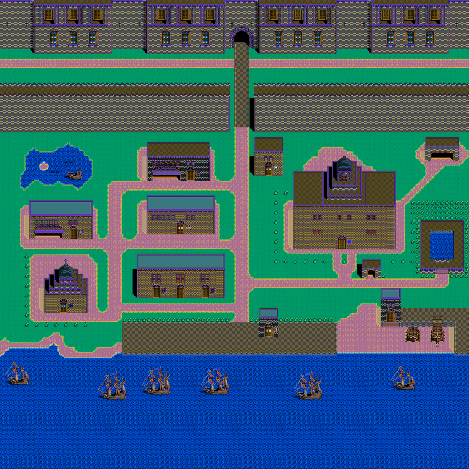
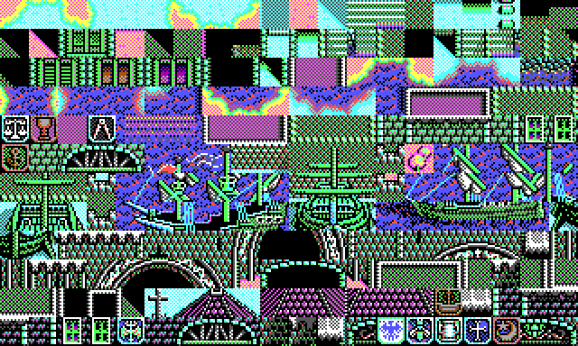

# 항구지도와 칩 — 101장의 96x96 지도, 일곱 벌의 칩

대상: `PORTMAP.LZW` · `PORTCHIP.LZW` · `CHIP_NO.DAT`.

한 줄 답: **`PORTMAP` 이 항구 101곳의 96 x 96 칸 지도, `PORTCHIP` 이 칩 일곱 벌,
`CHIP_NO.DAT` 이 항구마다 어느 벌을 쓰는지 적은 표다.**

항구 이름과 세계지도 위 자리는 [10.분석-항구 표(이름과 자리)](10.%EB%B6%84%EC%84%9D-%ED%95%AD%EA%B5%AC%20%ED%91%9C%28%EC%9D%B4%EB%A6%84%EA%B3%BC%20%EC%9E%90%EB%A6%AC%29.md) 에 있다.


**0번 리스본**을 `CHIP_NO.DAT` 이 가리키는 0번 벌로 그린 것이다. 성벽·문·거리·못·나무·부두가
그대로 나오고 **배 여섯 척이 부두에 매여 있다** — 배 그림도 항구 칩 안에 있다는 뜻이다.
색은 [9.분석-팔레트(열여섯 색)](9.%EB%B6%84%EC%84%9D-%ED%8C%94%EB%A0%88%ED%8A%B8%28%EC%97%B4%EC%97%AC%EC%84%AF%20%EC%83%89%29.md) 의 항해 화면 벌을 그대로 썼다(항구 벌이 따로 있을 수 있다).

## PORTMAP.LZW

청크 **101개, 하나가 9,216바이트**. `96 x 96 = 9216` 이라 **칸마다 한 바이트**다.
값이 곧 그 벌 안의 칩 번호다. 칩이 16x16 이니 항구 한 곳이 1536 x 1536 점이다.

## PORTCHIP.LZW

청크 열넷 — **30,720바이트짜리 일곱 개**와 **4바이트짜리 일곱 개**다.
30,720 / 128 = **240장**. 4바이트짜리는 안 눌린 채로 들어 있다(딸린 값으로 보인다).

한 장은 16x16 에 **면 넷을 겹쳐 그린 4비트 그림**이다.

```
조각 t 의 자리 = t * 128
  면 p (p=0..3) 의 자리 = t*128 + p*32
  줄 y 의 자리 = ... + y*2          (한 줄 2바이트 = 16점)
  점 x 의 비트 = MSB 먼저
  색인 = 면0비트 | 면1비트<<1 | 면2비트<<2 | 면3비트<<3
```



성벽·아치·나무·물·건물이 그대로 보인다.

**그리는 길**

```
PORTMAP.LZW[항구] ─→ 96 x 96 칸, 칸마다 칩 번호
CHIP_NO.DAT[항구] ─→ 벌 번호 0~6
PORTCHIP.LZW[벌]  ─→ 칩 240장 16x16
   └─ 팔레트 ─→ 색
```

칩 담는 꼴은 세계 칩과 같이 판마다 갈린다 — DOS 는 면 넷 겹판, Win95 는 4비트 꽉 채움이다
([7.분석-칸에서 칩으로](7.%EB%B6%84%EC%84%9D-%EC%B9%B8%EC%97%90%EC%84%9C%20%EC%B9%A9%EC%9C%BC%EB%A1%9C.md)).

## CHIP_NO.DAT

100바이트, 값이 **0~6** — 곧 `PORTCHIP` 의 **일곱 벌**과 딱 맞는다.
색인이 항구 번호, 값이 그 항구가 쓰는 칩 벌이다.

| 항구 번호 | 벌 | 수 |
|---|---:|---:|
| 0–26 (섞임) | 0 · 2 | 18 / 9 |
| 27–41 | 1 | 15 |
| 42–71 | 3 | 30 |
| 72–80 | 2 | 9 |
| 81–93 (섞임) | 3 · 6 | 8 / 5 |
| 94–97 | 4 | 4 |
| 98–99 | 5 | 2 |

번호가 지역순이라 **벌이 문화권을 가른다** — 이베리아·이슬람·북유럽·동양 같은 식이다.
`PORTMAP` 은 101장인데 표는 100칸이라 한 장이 남는다(0번이 견본이거나 표 밖으로 본다).

**처음에 이 표를 세계지도의 지형표로 잘못 봤다.** 값이 0~6 일곱 가지인 것이 3편의
칸당 눈금표와 닮아 그랬는데, `PORTCHIP` 이 일곱 벌 · `PORTMAP` 이 101장인 것을 보고
바로잡았다. 세계지도 통행 판정은 아직 못 찾았다 — [1.분석-해상이동 자산 한눈에](1.%EB%B6%84%EC%84%9D-%ED%95%B4%EC%83%81%EC%9D%B4%EB%8F%99%20%EC%9E%90%EC%82%B0%20%ED%95%9C%EB%88%88%EC%97%90.md) 참고.
