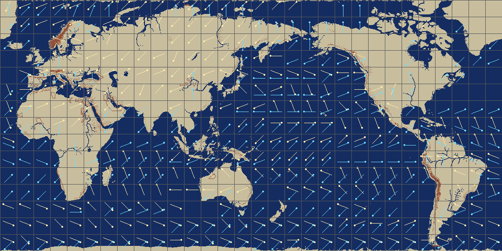

# 바람·해류 — 450바이트 표 세 장, 30 x 15 격자

대상: `WINDCUR.DAT` 1,350바이트. 원판·Win95판·모드판이 **바이트까지 같다**.

한 줄 답: **1,350은 450바이트 표 세 장이다** — 3~8월 바람 · 9~2월 바람 · 해류.
격자는 **30열 x 15행**이고 한 칸이 **72 x 72 칩 = 36 x 36 지도칸 = 경위도 12도**다.


누런 줄이 바람, 하늘색 줄이 해류다. 점이 붙은 쪽이 방위가 가리키는 쪽이다.

## 표 세 장인 근거

게임이 파일에서 **450바이트(`0x1C2`)씩** 읽어 간다.

```
00415BDF  mov edx, [0x00457678]      ; "c:WINDCUR.DAT"
00415BEB  call 0x0043A6F0            ; 열기
00415BF0  al = [0x004703DC]          ; 달
00415BF8  cmp al, 3 ; jb  0x415C04
00415BFC  cmp al, 9 ; jae 0x415C04
00415C00  xor eax, eax               ;  3 <= 달 < 9  ->  자리 0
00415C04  mov eax, 0x1C2             ;  그 밖        ->  자리 450
00415C11  call 0x0044DDDC            ; 자리 옮기기
00415C1E  ... 0x46EEC0 담개로 450바이트 읽기
```

`0x0042B771` 도 같은 짜임이다. 곧 **0장·1장이 철 따라 갈리는 바람**이고, 남은 2장이
**해류**다 — 값의 결이 다르다.

| 장 | 자리 | 것 | 방위 값 |
|---:|---:|---|---|
| 0 | 0 | 3~8월 바람 | 1~15 (0 과 8 이 없다) |
| 1 | 450 | 9~2월 바람 | 1~15 (0 과 8 이 없다) |
| 2 | 900 | **해류** | 0 이 백 번, 6·7·14·15 가 없다 |

3편도 표를 세 장 뒀다 — 1~6월 바람 · 7~12월 바람 · 해류(``16.분석-풍향·풍속·해류``).
**갈리는 달만 다르다**(3편 6월, 2편 8월).

## 격자가 30 x 15 인 근거

표를 짚는 손(`0x0041E270`)이 이렇게 셈한다.

```
0041E28C  eax = 0x2AAAAAAB ; imul ecx ; sar edx,2     ; edx = x / 24
0041E29D  eax = 0x55555556 ; imul edx                 ; edx = (x/24) / 3  =  x / 72
             (y 도 같은 셈)
0041E2D0  lea eax,[edx+edx*4] ; lea ecx,[eax+eax*8] ; shl ecx,1   ; ecx = 90 * 행
0041E2D6  eax = 0x55555556 ; imul ecx                 ; edx = 30 * 행
0041E2E8  add edx, ebx                                ; 담개 + 열 + 30*행
0041E2EA  mov dl, [ecx + edx]
```

```
열 = 함대x / 72     (0~29)
행 = 함대y / 72     (0~14)
색인 = 행 * 30 + 열
```

함대 좌표가 **칩 눈금**(0~2159, 0~1079)이라 한 칸이 72 x 72 칩이다. 2160/72 = 30,
1080/72 = 15 로 딱 떨어지고 칸이 네모반듯하다.

**나누어떨어지는 폭을 다 대 보고 잰 이음매 일치도 폭 30 에서만 솟는다**
(0.176 / 0.186 / 0.236 — 다른 폭은 0.03~0.14).

## 바이트 한 칸

| 비트 | 뜻 | 값 |
|---|---|---|
| `0..3` | 방위 | 0~15 |
| `4..5` | 세기 | 0~3 |
| `6`, `7` | 깃발 | 바람 장에 각 4·44칸, 해류 장에 35·25칸. **뜻을 모른다** |

방위가 "불어오는 쪽"인지 "밀어가는 쪽"인지는 아직 안 굳혔다. 3편은 **밀어가는 쪽**이었다.
지도에 화살표를 얹어 무역풍·편서풍 띠가 위도대로 눕는지 보면 갈린다 — 위 그림에서
저위도와 중위도의 결이 갈리는 것은 보이는데, 어느 쪽으로 부는 것인지는 아직 못 박았다.

## 남은 것

- 깃발 두 비트.
- 방위가 도는 쪽(시계/반시계)과 0 이 가리키는 방위.
- 해류 장을 게임이 읽는 자리. 바람 두 장을 읽는 자리(`0x00415BDF`·`0x0042B771`)는 찾았는데
  900자리를 읽는 손은 아직 못 찾았다.
