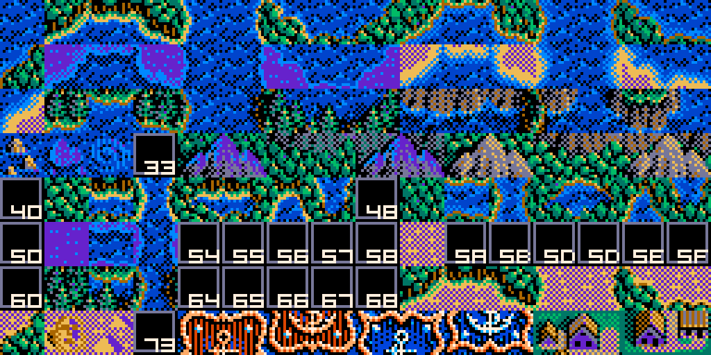

# 칸에서 칩으로 — 한 칸이 칩 넷이 된다

대상: `KOUKAI2.EXE 0x0041DE78` (조각을 푼 뒤 화면 칸으로 펴는 손).

한 줄 답: **세계지도 한 칸은 그리는 자리에서 2 x 2 칩이 된다.**
그래서 온 지도가 **2160 x 1080 칩**이고, 함대·괴물 좌표도 이 눈금이다.

## 값 < 16 — 네 비트가 그대로 뭍 자국이다

```
0041DEF2  mov cl, al ; and cl, 8 ; neg cl ; sbb ecx,ecx ; and ecx,0x41 -> [esi]       좌상
0041DEFD  mov dl, al ; and dl, 2 ; neg dl ; sbb edx,edx ; and edx,0x41 -> [esi+0x60]  좌하
0041DF11  mov cl, al ; and cl, 4 ; ...                                  -> [esi+1]    우상
0041DF19  and al, 1 ; ...                                               -> [esi+0x61] 우하
```

| 비트 | 자리 |
|---|---|
| 3 (`8`) | 좌상 |
| 2 (`4`) | 우상 |
| 1 (`2`) | 좌하 |
| 0 (`1`) | 우하 |

켜져 있으면 **뭍 칩 `0x41`(65)**, 꺼져 있으면 **바다 칩 `0`** 이다.
그러니 값 0 은 온통 바다, 값 15 는 온통 뭍이고 1~14 가 해안의 열넉 가지 꼴이다.

## 값 >= 16 — 그림표에서 칩 넷을 꺼낸다

```
0041DE83  mov ecx, 0x46F868 ; call 0x44DFB9      ; 그림표 담개
0041DE9D  lea ecx, [eax + edx*4]                 ; 표[값]
0041DEA0  al = 표[값][0] ; if (al < 0x34) al = 0 -> [esi]        좌상
0041DEB2  al = 표[값][2] ; 〃                     -> [esi+0x60]   좌하
0041DEC5  al = 표[값][1] ; 〃                     -> [esi+1]      우상
0041DED8  cl = 표[값][3] ; 〃                     -> [esi+0x61]   우하
```

**칩 번호가 `0x34`(52)보다 작으면 바다(0)로 눌린다.**

그림표는 **`DATA1.LZW` 의 18번 청크, 1,024바이트 = 256칸 x 4바이트**다.
읽는 자리가 `0x00415BC0` 이다.

```
00415BC0  mov ecx, 0x46F868 ; call 0x44DFB9
00415BCA  push eax ; push 0x12 ; call 0x41C300   ; DATA1.LZW 의 18번 청크
```

값이 16 아래인 칸은 표 자리가 0 으로 비어 있어 안 쓴다. 몇 가지 보기.

| 칸 값 | 표 | 것 |
|---:|---|---|
| 16 | 116 117 118 119 | |
| 17 | 124 125 126 127 | |
| 32 | 52 53 54 55 | |
| 101 | 89 89 89 89 | 넉 장이 같다 |
| 110 | 107 65 89 107 | 뭍 칩 65 가 섞인다 |
| 175 | 58 59 60 61 | 지도에서 7,019칸으로 가장 흔한 특수 값 |

원판과 Win95 이식판의 그림표가 **바이트까지 같다**.

## 실제로 깔리는 칩은 마흔한 가지뿐이다

그림표에는 칩 번호가 마흔여섯 가지 적혀 있는데(0 · 52~63 · 65 · 73~75 · 81 · 89 · 97 ·
105~127 · 136 · 138 · 254 · 255), **지도에 실제로 깔리는 것은 마흔한 가지**이고
**128 이상은 하나도 안 나온다**. 136·138·254·255 는 지도에 없는 칸 값의 자리라 쓰이지 않는다.

| 칩 | 칸 수 | 몫 | 것 |
|---:|---:|---:|---|
| 0 | 1,561,860 | 66.9% | 큰바다 |
| 65 | 754,566 | 32.3% | 민뭍 |
| 89 | 1,558 | | |
| 73 | 1,527 | | |
| 52~55 | 각 1,500 안팎 | | |
| 58~61 | 각 1,130 안팎 | | |

## 통행 판정 — 칩 0 이 바다다

`MONSTER.DAT` 의 자리 서른 곳이 **하나도 빠짐없이 칩 0** 위에 있고, 그 둘레 3x3 이백일흔 칸
가운데 뭍 칩은 **한 칸**뿐이다. 곧 **배가 다니는 데는 칩 0** 이다.

EXE 안의 판정 자리는 아직 못 찾았다 — `.data`/`.rdata` 에 256칸짜리 표는 없다.
해안 칩(52~63 따위)을 배가 지날 수 있는지가 아직 안 갈렸다.

## 칩 그림

`DATA1.LZW` **11번 청크의 앞 16,384바이트**가 세계 칩 **128장**이다(원판은 청크가
32,768바이트, Win95판은 49,152바이트라 벌이 더 들어 있다 — 뒷쪽은 아직 안 읽었다).
한 장이 **128바이트**인 것은 두 판이 같은데 **점을 담는 꼴이 다르다.**

**DOS 원판 — 면 넷 겹판**

```
조각 t 의 자리 = t * 128
  면 p (p=0..3) = t*128 + p*32
  줄 y          = ... + y*2       (한 줄 두 바이트 = 열여섯 점)
  점 x 의 비트  = MSB 먼저
색인 = 면0비트 | 면1비트<<1 | 면2비트<<2 | 면3비트<<3
```

**Win95 이식판 — 4비트 꽉 채움**

```
줄 y = t*128 + y*8              (한 줄 여덟 바이트 = 열여섯 점)
짝수 점은 윗 니블, 홀수 점은 아랫 니블
```

**그림은 두 판이 똑같다.** 이식하며 담는 꼴만 바꾼 것이라, 어느 쪽으로 풀든 칩 0 은
색인 9 가 181점 · 0 이 49점, 칩 65 는 0 이 90점 · 13 이 80점으로 나온다.
아틀라스로 펴 보면 32,768바이트가 **바이트까지 같다.**

**가려내는 법**: 잘못 풀면 한 칩에 색인이 열대여섯 가지로 흩어지고, 제대로 풀면 서너
가지로 뭉친다. 앞쪽 칩 몇 장의 색인 가짓수를 재면 바로 갈린다.



칩 0 이 큰바다, 65 가 민뭍이고 그 사이가 해안·강·산·숲·사막이다.
색은 [9.분석-팔레트(열여섯 색)](9.%EB%B6%84%EC%84%9D-%ED%8C%94%EB%A0%88%ED%8A%B8%28%EC%97%B4%EC%97%AC%EC%84%AF%20%EC%83%89%29.md) 의 벌로 칠했다.

## 정리

```
WORLDMAP.LZW ─(LS11)→ 청크 3 ─(조각+본보기)→ 칸 1080x540
   └─ 칸 값 ─(2x2 자국 또는 DATA1[18] 그림표)→ 칩 2160x1080
        └─ 칩 번호 ─(DATA1[11] 겹판 16x16)→ 색인 0~15
             └─ 팔레트(MAIN.EXE 0x3EBCE) ─→ 색
```
