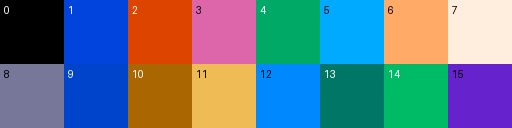

# 팔레트 — 항해 화면 열여섯 색

대상: DOS `MAIN.EXE`. Win95 이식판은 `CreateDIBSection` 으로 갈아탔고 딸린 `Pal.Dat`(768 B)은
6단계 216색 정육면체라 **게임 색이 아니다** — 이식하며 만든 것이다.

한 줄 답: **색 하나가 세 바이트(파랑·빨강·초록), 성분마다 네 비트다.**
항해 화면 벌은 `MAIN.EXE` **이미지 `0x3EBCE`** 에 있다.




## 모양은 붓는 손이 알려 준다

`MAIN.EXE` 이미지 `0x156B` 이 VGA DAC 에 붓는다.

```
mov bl,[bp+6] ; and bx,0xF        ; 첫 색인 (0~15)
mov cl,[bp+8]                     ; 색 수 (많아야 16)
mov si,[bp+0xA]                   ; 벌이 있는 자리
sub sp,0x30                       ; 48바이트 = 16색 x 3
loop:
  lodsw ; xchg al,ah ; shl al,1 ; shl al,1 ; stosb   ; 빨강
  lodsb ;             shl al,1 ; shl al,1 ; stosb   ; 초록
          xchg al,ah ; shl al,1 ; shl al,1 ; stosb   ; 파랑
...
out 0x3C8 / 0x3C9                 ; DAC 에 붓는다
```

세 바이트를 `(b0, b1, b2)` 라 하면 **`빨강 = b1`, `초록 = b2`, `파랑 = b0`** 이고,
두 번 왼쪽으로 밀어 DAC 여섯 비트를 만든다(0~15 → 0~60).

## 어느 벌인지 고른 방법

이미지에서 48바이트가 다 열다섯 이하이고 **검정으로 시작하는** 자리가 열둘 있다
(`0x3EBCE` · `0x3EBFE` · `0x3FB34` · `0x4008D` · `0x402CF` · `0x402D2` · `0x40302` ·
`0x40332` · `0x40362` · `0x40392` · `0x40500` · `0x40530`).

칩 그림에서 이미 아는 것이 있다.

```
바다 칩 0    : 색인 9 가 181점, 0 이 49점, 12 가 26점
뭍   칩 0x41 : 색인 0 이 90점, 13 이 80점, 14 가 70점
```

그러니 **9 는 파랗고 13·14 는 안 파란** 벌이 항해 화면 벌이다. 그 잣대로 재면
`0x3EBCE` 와 `0x40332` 가 나란히 으뜸이고 둘은 같은 벌이다.

## 벌

| 색인 | B R G | 색 | 어디 쓰나 |
|---:|---|---|---|
| 0 | 0 0 0 | `#000000` | 테두리·그늘 |
| 1 | 13 0 4 | `#0044DD` | 파랑 |
| 2 | 0 13 4 | `#DD4400` | 빨강 |
| 3 | 10 13 6 | `#DD66AA` | 분홍 |
| 4 | 6 0 10 | `#00AA66` | 초록 |
| 5 | 15 0 10 | `#00AAFF` | 하늘 |
| 6 | 6 15 10 | `#FFAA66` | 살구 |
| 7 | 13 15 14 | `#FFEEDD` | 흰빛 |
| 8 | 9 7 7 | `#777799` | 잿빛 — **산** |
| 9 | 12 0 4 | `#0044CC` | **바다** |
| 10 | 0 10 6 | `#AA6600` | 밤빛 |
| 11 | 5 14 11 | `#EEBB55` | 모래 — **사막** |
| 12 | 15 0 8 | `#0088FF` | 밝은 파랑 — 물결 |
| 13 | 6 0 7 | `#007766` | 짙은 초록 — **뭍** |
| 14 | 6 0 11 | `#00BB66` | 초록 — **뭍** |
| 15 | 12 6 2 | `#6622CC` | 보라 |

이 벌로 그리면 바다가 남색, 뭍이 초록, 강이 파랑, 사막이 옅은 살구, 산이 잿빛으로
나온다 — 게임 화면과 같다.

## 남은 것

나머지 벌 열하나가 어느 화면 것인지. `0x3EBFE` 는 `0x3EBCE` 와 앞 여덟 색이 같고 뒤가
어두운 것이라 **가라앉히는 벌**로 보인다(밤이나 안개). `0x3EBB8` 의 스물두 바이트
(`15 13 16 12 02 03 04 07 …`)는 색인 바꿈표로 보인다.
